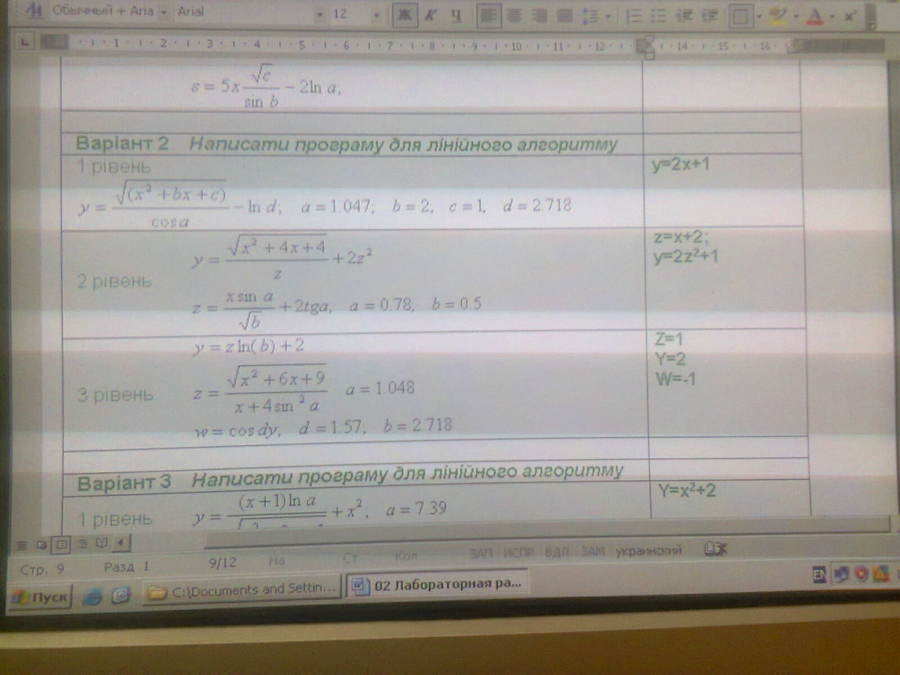

Программа для лiнiйного алгоритму
============================================

* [Программирование линейных алгоритмов](http://vunivere.ru/work1339)
* [Квадратный трёхчлен](http://mathematics.ru/courses/algebra/content/chapter2/section1/paragraph4/theory.html#.Vg5KdFP7t0w)
* [Формулы сокращённого умножения](http://egesdam.ru/page252.php)

